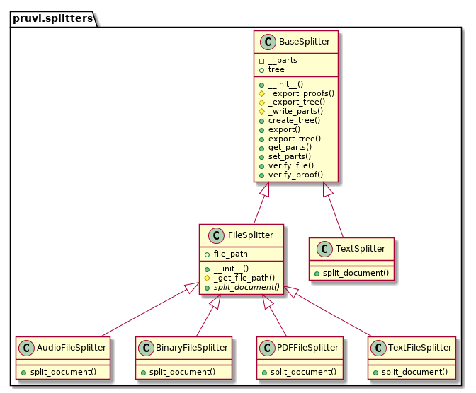

# Pruvi

`pruvi` is a Python3.6+ package to create proofs for certain parts of different types of documents using Merkle Trees.

## Use Cases

Have you agreed something with another guy and you want to prove it to a third party without revealing the whole document?
Are you in the middle of a laboral discussion with your CEO and you want to prevent him from saying "I have never said that"?
Are you negotiating with a third party which has been in the past prone to acting that way?

In many cases, these aspects could not be proved because they may imply having to make public the whole document.
However, `pruvi` tries to help by providing a way of proving the existence of certain part of an agreement (understood as a text document, audio file or even an image) without having to reveal the whole document, just the part you need.

## Installation

Install it using `pip`:

```
pip3 install pruvi --user
```

## CLI Usage

To launch the application, use `pruvi --help`:

```
$ pruvi --help
                 ____                   _
                |  _ \ _ __ _   ___   _(_)
                | |_) | '__| | | \ \ / / |
                |  __/| |  | |_| |\ V /| |
                |_|   |_|   \__,_| \_/ |_|


                 Coded with ♥ by @febrezo


Pruvi [ERROR] > 'None' is not a valid subcommand.
usage: pruvi [-h] [--version] [-L <LOG_LEVEL>] <SUBCOMMAND> ...

Pruvi | A tool for generating partial proofs of big documents

Other commands:
Get additional information about this program.

-h, --help            shows this help and exits.
--version             shows the version of this package and exits.
-L <LOG_LEVEL>, --log-level <LOG_LEVEL>
   The log level to be set.

subcommands:
Available commands.

<SUBCOMMAND>
generate            Create proofs from different files.
validate            Validate a proof.

For each subcommand, add '--help' for additional parameters.
```

## Class Diagram

To ease the process of creation of new splitters, the splitters SHOULD inherit from the `pruvi.splitters.base.BaseSplitter` object.
Thus, devs will only need to implement the `split_document()` method to create the binary parts of the document to be splitted.


